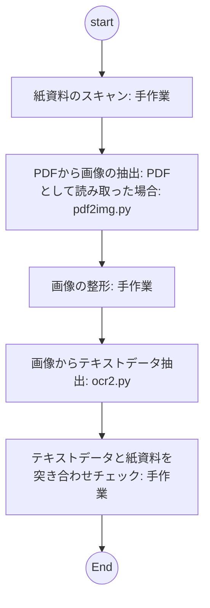

# python ocr 処理

既存のPDFからテキストを抽出するための処理を行う




## PDFから画像の抽出

pdf2img.py

### 事前準備

入力PDFファイル指定部分を修正

```
  filename = "list_ex.pdf"
```

出力用 output フォルダを準備しておくこと

```
  out_file = "output/extracted_image{}.png".format(num_of_pics)
```

### 実行

```
python pdf2img.py
```


## 画像の整形

> ここは手作業！

表形式など複雑な形状は読み取り精度が下がりやすく、読み取ったとしてもテキストの配置が表計算ソフトに直接貼り付けられるような形式ではない(セル分割されて貼り付けられたりはしない)ため、なるべく読み取りたい文字列のみとなるように画像編集ソフト等で画像を加工しておく。

- 漢字氏名部分のみ切り出す
- 文字以外の点や線を消去しておく

## 画像からテキストデータ抽出

ocr2.py

### 事前準備

入力フォルダ部分を修正する

```
dir = "img_name"
```

出力用フォルダ text を作成しておくこ

```
with open(f"text/{file[:-4]}.txt", mode="w") as f:
```

### 実行

python ocr2.py

## 参考

- ocr.py
  tesseract 版のOCR 今回試した限りでは読み取り精度は高くなかった。
  devcontainerには必要なライブラリを含めていません。試す場合は自分でインストールしてください。


## 参考2

[【Python】簡単OCR](https://qiita.com/masa1124/items/198ceea22becdf311f31)
[【Pythonで自動化】PyMuPDFでPDFの画像を抜き出す](https://hogelog.com/python/pymupdf-3-html.html)
